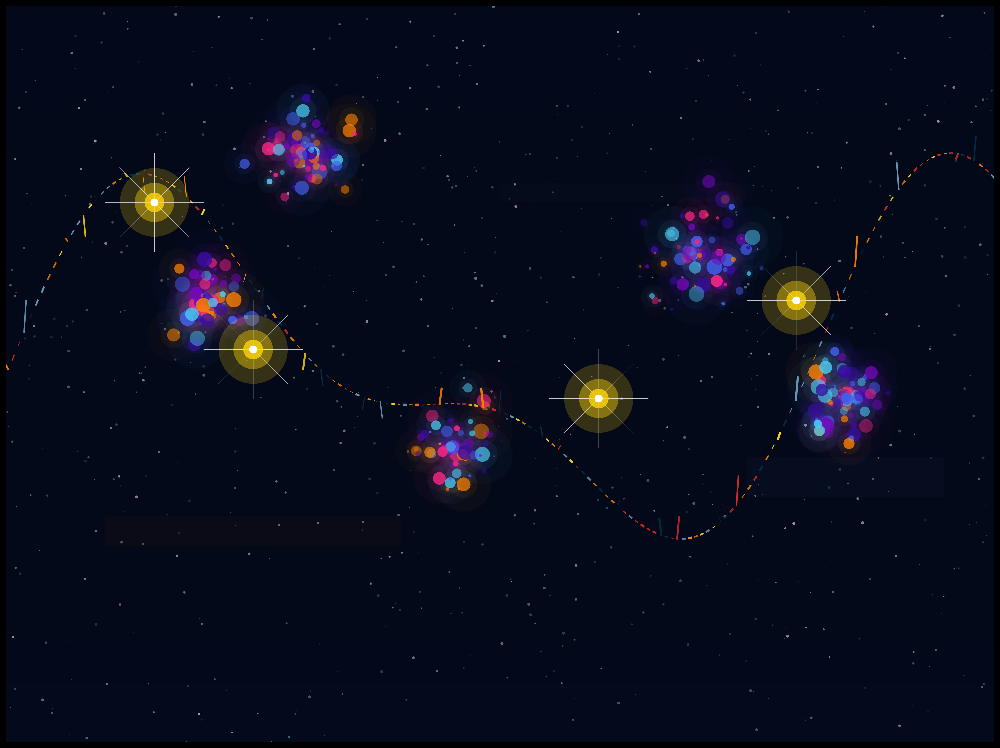

# Claude Tool MCP

[中文版本](./README_CN.md)

This project is an MCP server that allows using Claude's skill system on other LLM, especially skills from the [anthropics/skills](https://github.com/anthropics/skills/tree/main) repository.

## Prerequisites

- Python 3.12
- uv package management tool

## Usage Steps

### 1. Clone this repository

```bash
git clone https://github.com/SimFG/claude-skill-mcp.git
cd claude-skill-mcp
```

### 2. Sync dependencies

Use uv to sync project dependencies:

```bash
uv sync
```

### 3. Clone Claude Skills repository

```bash
git clone https://github.com/anthropics/skills.git
```

### 4. Configure MCP server

Create or modify the MCP configuration file, add the following content (please replace `xxx` with actual paths):

```json
{
  "mcpServers": {
    "claude-skill-mcp": {
      "command": "uv",
      "args": [
        "run",
        "mcp",
        "run",
        "/xxx/claude-skill-mcp/server.py"
      ],
      "env": {
        "CLAUDE_TOOL_PATH": "/xxx/skills",
        "UV_PYTHON": "/xxx/claude-skill-mcp/.venv"
      }
    }
  }
}
```

## Features

This MCP server can:

- Load tools from the Claude Skills repository
- Provide tool list and usage interface
- Allow other large models to call Claude-style tools

## Supported Tools

By loading the anthropics/skills repository, you can use various tools including but not limited to:

- Document processing tools (docx, pdf, pptx, xlsx)
- Creative design tools
- Development and technical tools
- Enterprise communication tools

## Notes

- Please ensure Python version is 3.12
- Use absolute paths when configuring paths
- The environment variable `CLAUDE_TOOL_PATH` can point to multiple skill directories, separated by commas
- The environment variable `UV_PYTHON` must point to the project's virtual environment directory

## Example

Here is an example of using the canvas-design tool to draw a star river themed image:

**Input**:
Use canvas-design tool to draw an image with star river theme, output png

**Output**:
The generated image is shown below:

